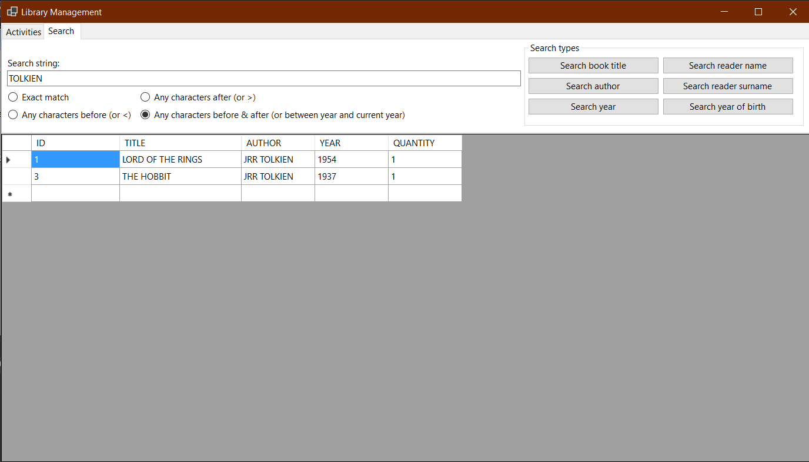
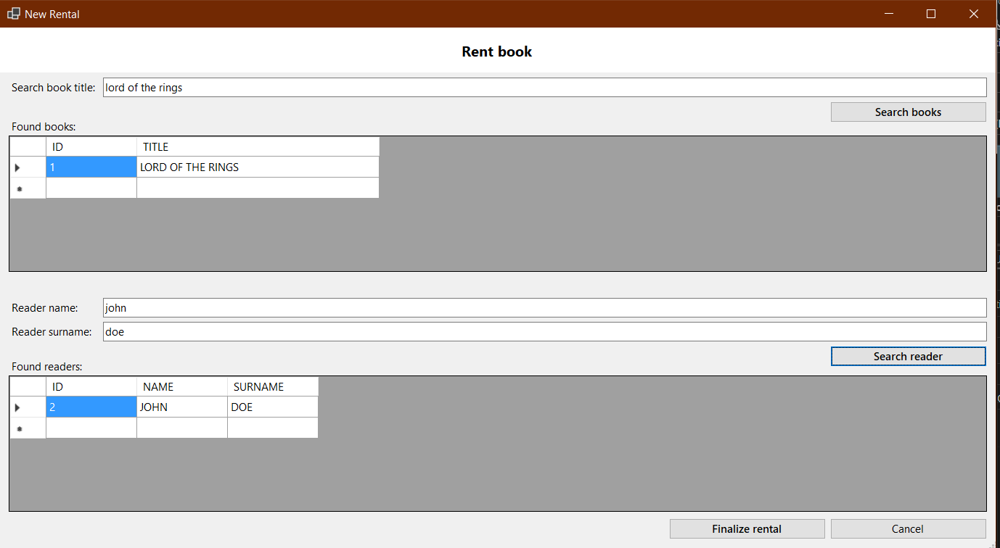
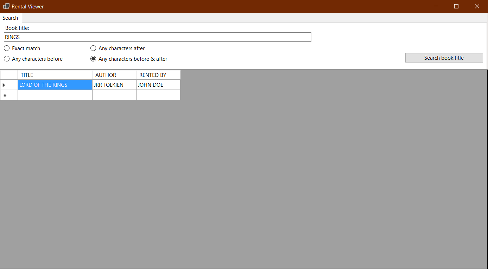
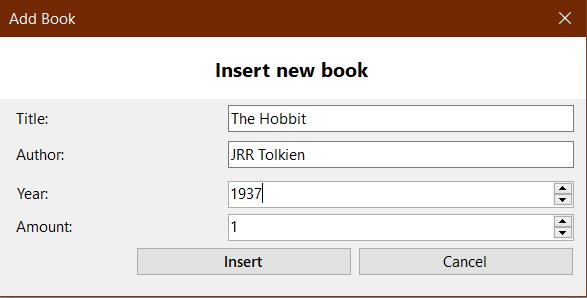
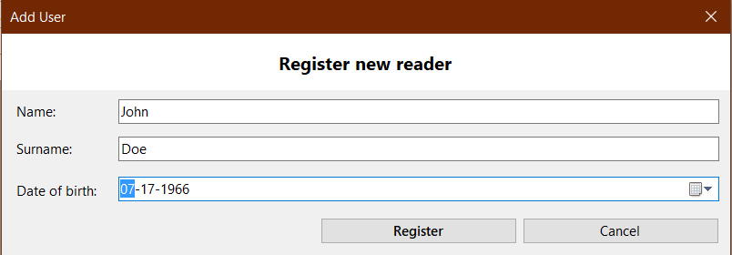

# SharpLibrary

A simple library management system written in C# that uses a local SQL Server database as a backend.

The database SQL is available in the _db_ folder.

**Remember to replace $FILEPATH and $INSTANCENAME in _Login.cs_ before compiling and running!**

Missing functionalities:
- The _QUANTITY_ field is currently unused
- Missing a system for when a reader fails to return a rented book
- Instance name and .mdf path should be loaded by a settings system

Tested on Windows 10 on a SQL Server LocalDB Express database instance.

## Some more screenshots:

